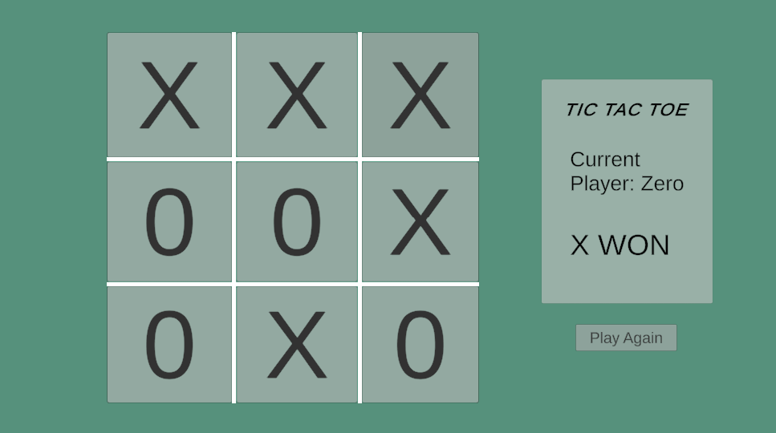
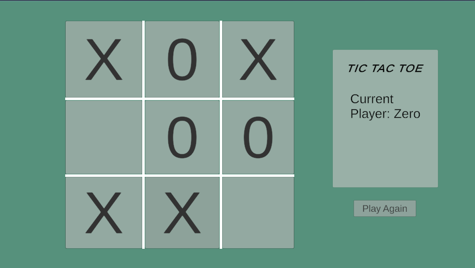
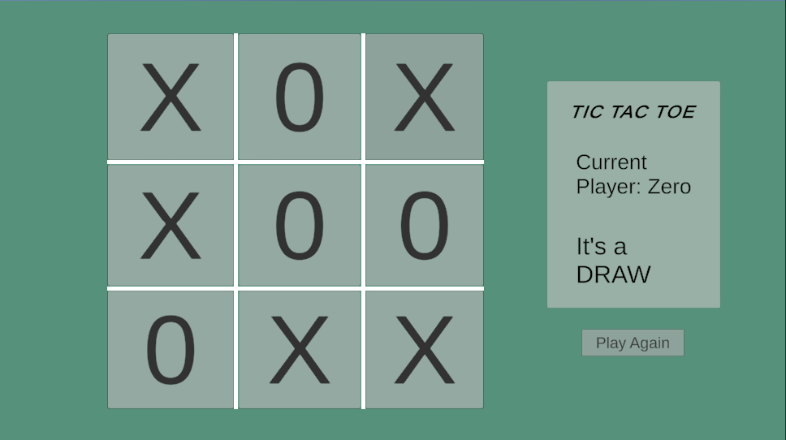

# Tic Tac Toe Game - Unity Project

## Screenshots

# Tic Tac Toe Game - Unity Project

## Descriere
Acest proiect reprezinta un joc simplu de **Tic Tac Toe** realizat in **Unity**, implementat folosind principii solide de **programare orientata pe obiect** si doua **design patterns**: **Singleton** si **Observer**.  
Scopul acestui proiect este de a demonstra utilizarea corecta si integrata a acestor pattern-uri in logica jocului, asigurand astfel o structura curata si extensibila.  
**Jocul este multiplayer**, permitand doua persoane sa joace unul impotriva celuilalt pe aceeasi masina.

## Design Patterns folosite

### 1. **Singleton**
- **Rol**: Gestionarea instantei unice a jocului prin clasa `GameManager`.
- **Descriere**: Acest pattern garanteaza ca exista o singura instanta a clasei `GameManager` pe tot parcursul jocului, asigurandu-se ca gestionarea starii generale a jocului (pornire joc, resetare, control jucatori) este centralizata.
- **Beneficii**: Simplifica gestionarea jocului si previne instantierea multipla a clasei.

### 2. **Observer**
- **Rol**: Comunicarea intre componentele jocului prin evenimente.
- **Descriere**: Pattern-ul Observer este implementat prin evenimente statice in clasa `GameManager`, ce permit componentelor jocului sa fie notificate automat atunci cand se intampla anumite actiuni majore (de exemplu: schimbarea jucatorului, resetarea jocului, terminarea jocului).

    Evenimentele implementate sunt:
    - `OnGameStarted`: Se declanseaza cand jocul incepe.
    - `OnGameReseted`: Se declanseaza cand jocul este resetat.
    - `OnDraw`: Se declanseaza cand jocul ajunge la un remiza.
    - `OnGameOver`: Se declanseaza cand jocul se termina cu un castigator.
    - `OnPlayerTurnSwitched`: Se declanseaza cand se schimba jucatorul.

### Cum afecteaza Observer pattern-ul componentele jocului:

- **WinnerPanel**:  
  `WinnerPanel` este un panou care afiseaza castigatorul jocului. Cand un jucator castiga, evenimentul `OnGameOver` este declansat, iar `WinnerPanel` asculta acest eveniment. Cand se produce evenimentul, `WinnerPanel` isi actualizeaza mesajul pentru a arata cine a castigat sau daca jocul s-a terminat la remiza.

- **Continutul butoanelor (Cell Buttons)**:  
  Fiecare celula a tablei de joc este reprezentata de un buton (de exemplu, `CellButton`). Atunci cand un jucator face o miscare, evenimentul `OnPlayerTurnSwitched` este declansat. Aceasta notificationeaza butoanele sa actualizeze textul pentru a reflecta miscare jucatorului curent (`X` sau `O`). In plus, daca jocul se termina (prin `OnGameOver`), butoanele sunt dezactivate pentru a preveni mutarile suplimentare.

Astfel, **Observer** permite actualizarea automata a componentelor, fara a necesita o legatura directa intre ele, facand aplicatia mai modulara si mai usor de extins.

## Teste Unitare

Proiectul include doua teste care verifica corectitudinea logicii de baza a jocului:

### 1. **Verificarea completarii tablei**
   - **Test**: Verifica daca metoda `IsBoardFull()` returneaza `true` atunci cand toate celulele de pe tabla de joc sunt completate.
   - **Scenariul de test**: Seteaza toate celulele la `X` si verifica daca tabla este completa.

### 2. **Verificarea ca exista celule goale**
   - **Test**: Verifica daca metoda `IsBoardFull()` returneaza `false` atunci cand cel putin o celula este goala.
   - **Scenariul de test**: Seteaza toate celulele la `X`, iar apoi face prima celula goala, verificand daca tabla nu este completa.
